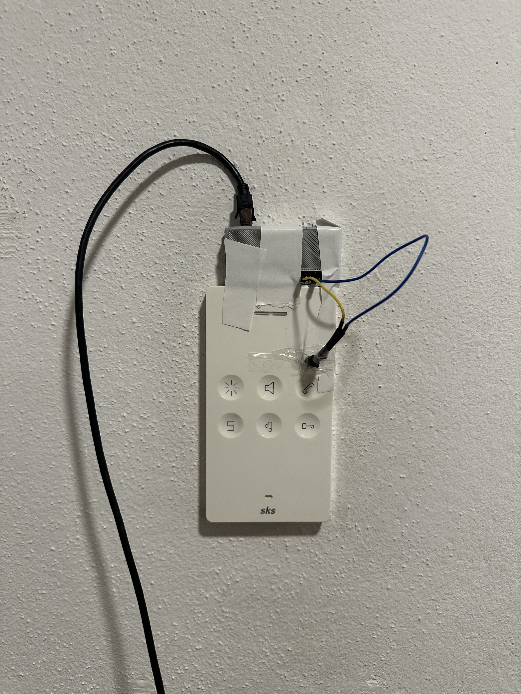

# 🔔 Raspberry Pi LDR Blink Detector with MQTT (C# / Mono)

This project detects light pulses (e.g. from a blinking doorbell LED) using a **light-dependent resistor (LDR)** connected to a **GPIO pin** on a Raspberry Pi.  
When a light pulse is detected, a message is sent via **MQTT**.

It runs as a background service using **C# with Mono**, as .NET (Core) isn't supported on Raspberry Pi 1 / Zero (armv6).

---

## ⚙️ Requirements

- Raspberry Pi (Zero, Zero 2 W, 3, 4, etc.)
- Raspbian / Raspberry Pi OS (i am using dietpi)
- Mono (runtime for C#) and dependencies
- LDR (light-dependent resistor)
- MQTT broker (local or remote)

---

## 📦 Installation (Mono Runtime)

Install Mono and libgpiod:

```bash
sudo apt update
sudo apt install mono-complete libgpiod2 libgpiod-dev
```

> `mono-complete` includes the full Mono runtime and development tools.

---

## 🔌 Hardware Wiring

| LDR Pin | Raspberry Pi Pin        |
|---------|--------------------------|
| One side | GPIO18 (BCM) – Physical Pin 12 |
| Other side | GND (e.g. Pin 6)          |

You can use the internal pull-up resistor in software — no extra hardware required.

---

## 📁 Configuration (`appsettings.json`)

```json
{
  "Gpio": {
    "LdrPin": 18
  },
  "MQTT": {
    "Server": "mqtt.example.com",
    "Port": 1883,
    "ClientId": "ldr-sensor-01",
    "User": "myMqttUser",
    "Value": "myMqttPassword",
    "Topic": "sensors/ldr/blink"
  }
}
```

---

## 🧠 What It Does

- Initializes a GPIO pin as input with pull-up
- Monitors the pin for a light-triggered LOW signal
- When light is detected, sends an MQTT message to the configured topic

---

## 🚀 How to Run (via Mono)

1. Build your C# project targeting `.NET Framework 4.8` (or similar)
2. Copy it to the Raspberry Pi
3. Run the app:

```bash
sudo mono MyApp.exe
```

> `sudo` is required for GPIO access.

---

## 📌 Notes

- Make sure your user has access to `/dev/gpiomem` or run with `sudo`
- Debounce logic is included to avoid spamming messages
- You can expand this to detect longer pulses or multiple brightness levels

---
# 🧰 Running as a systemd Service (Root)

To automatically start the LDR blink detector on boot and keep it running in the background, you can install it as a `systemd` service.

---

## ✅ 1. Create the service file

Create a file called:

```bash
/etc/systemd/system/ldr-service.service
```

Paste the following content:

```ini
[Unit]
Description=Raspberry Pi LDR Blink Detector (.NET/Mono)
After=network.target

[Service]
Type=simple
ExecStart=/usr/bin/mono /root/RaspiLDR2MQTT/RaspiLDR2MQTT.exe
WorkingDirectory=/root/RaspiLDR2MQTT
Restart=on-failure
RestartSec=5
User=root
Environment=DOTNET_SYSTEM_GLOBALIZATION_INVARIANT=1

[Install]
WantedBy=multi-user.target
```

> Make sure the path to the `.exe` and working directory is correct.

---

## ⚙️ 2. Enable and start the service

```bash
sudo systemctl daemon-reload
sudo systemctl enable ldr-service.service
sudo systemctl start ldr-service.service
```

---

## 📄 3. Check service status and logs

```bash
sudo systemctl status ldr-service.service
```

---

## 🧽 4. (Optional) Stop and disable

To stop and remove the service:

```bash
sudo systemctl stop ldr-service.service
sudo systemctl disable ldr-service.service
```

## 📄 License

MIT – free to use and modify.

## 🙏 Acknowledgements
- ChatGPT for the README.md generation
- Awesome Raspi Pinout at https://pinout.xyz/
